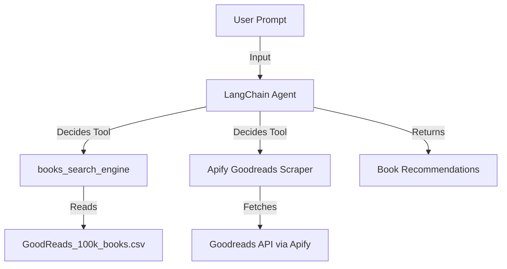

# 📚 Sprint Generative AI – Tutorials & Book Recommendation Agent


This repository was developed as part of the **[PrograMaria Sprint IA Generativa](https://www.programaria.org/evento/programaria-sprint-ia-generativa/)**.

### 📖 About the Sprint

Generative Artificial Intelligence is transforming how we create, decide, communicate, and build products. But how can we go beyond the basics and apply this technology in our professional lives?

**PrograMaria Sprint** is a 9‑day online minicourse designed to help you understand the impact of Generative AI in different fields and how to apply it efficiently in your daily work. The journey includes **lives, videos, articles, and hands‑on activities** to learn concepts and skills for using Generative AI in technology, whether to increase productivity or to build AI‑powered products and solutions.

Throughout the sprint, tools like **ChatGPT, GitHub Copilot, Gemini**, and others are explored with real‑world applications and case studies.

---

## 📺 Official Classes and Repositories

### 🔹 **Getting Started with Generative AI APIs: OpenAI & Gemini in Practice**

- ▶️ [Watch the class](https://www.youtube.com/watch?v=4pKlrdOU8nM&t=233s)
- 📂 [Official repository](https://github.com/lauraDamacenoAlmeida/primeiros_passos_AI_Gen)

---

### 🔹 **Workshop: Learn Predictive Query Models by Building a Generative AI Book Recommender**

* 📺 [Class 1](https://www.youtube.com/watch?v=VwBU6jqtOTM&t=4s)
* 📺 [Class 2](https://www.youtube.com/watch?v=4c40MdZRKew)
  - 📂 [Official repository](https://github.com/carolinasilvadev/recomendador_livros_programaria)

📊 **Dataset used:** [Goodreads Books 100k (Kaggle)](https://www.kaggle.com/datasets/mdhamani/goodreads-books-100k/data)

---

## 🚀 Features

- ✅ Examples of using **OpenAI** and **Gemini** APIs for text generation
- ✅ A **LangChain + MCP agent** capable of recommending books based on user preferences
- ✅ Integration with **local CSV datasets** and **Apify's Goodreads scraper**

---

## 📂 Project Structure

```
sprint-ia-generativa/
├── Gen_AI_APIs/                # Practical tutorials with Generative AI APIs
│   ├── gen_text.ipynb          # Jupyter Notebook – text generation tutorial
│   ├── test_openai_connection.py # OpenAI API key test script
│   └── test_gemini_connection.py # Gemini API key test script
│
├── agents/
│   └── book_recommender/       # LangChain + MCP book recommendation agent
│       ├── main_agent.py       # Main agent script (interactive chat)
│       ├── book_search_tool.py    # MCP tool to query local book dataset
│       └── data/
│           └── GoodReads_100k_books.csv # Books dataset
│
├── requirements.txt
├── LICENSE
└── README.md
```

---

## 🔧 Setup Instructions

### 1️⃣ Clone the repository

```bash
git clone https://github.com/AngelOttoni/sprint-ia-generativa.git
cd sprint-ia-generativa
```

### 2️⃣ Create and activate a virtual environment

```bash
python3 -m venv .venv
source .venv/bin/activate   # Linux/macOS
.venv\Scripts\activate      # Windows
```

### 3️⃣ Install dependencies

```bash
pip install -r requirements.txt
```

---

## 🔑 Configure API Keys

Create a `.env` file in the **project root** (or inside `Gen_AI_APIs/`) with:

```env
# OpenAI
OPENAI_API_KEY="your_api_key"

# Change this value to use another available model (e.g., gpt-4.1 or gpt-3.5-turbo).
OPENAI_MODEL="gpt-4o-mini"

# Gemini
GEMINI_API_KEY="your_api_key"

# Change this value to use another available model (e.g., gemini-2.0-pro or gemini-2.5-pro).
GEMINI_MODEL="gemini-1.5-flash"

# Apify
APIFY_API_KEY="your_api_key" # Required for Goodreads scraper
```

The project automatically loads these variables via **python‑dotenv**.

---

## ▶️ Testing OpenAI API

Run the OpenAI test script:

```bash
python Gen_AI_APIs/test_openai_connection.py
```

✅ Expected output: a **short bedtime story** generated by the model.

---

## 📓 Running the Jupyter Notebook Tutorial

```bash
jupyter notebook Gen_AI_APIs/gen_text.ipynb
```

Follow the step‑by‑step instructions to experiment with text generation.

---

## 🤖 Running the Book Recommendation Agent

### 1️⃣ Go to the agent directory

```bash
cd agents/book_recommender
```

### 2️⃣ Start the interactive agent

```bash
python chat.py
```

### 3️⃣ Examples of user prompts

```
I want a short romance novel
Find a long fantasy book
Give me books similar to "Atomic Habits"
```

The agent will:
- ✅ Interpret your request
- ✅ Decide whether to search the **local dataset** or **Apify Goodreads API**
- ✅ Return the **top 5 highest‑rated books** based on your query

---

## 📦 How It Works



---

## 🛠️ Tech Stack

* **OpenAI API** – LLM for text generation and reasoning
* **Google Gemini API** – alternative LLM for experiments
* **LangChain + LangGraph** – agent framework
* **FastMCP + langchain\_mcp\_adapters** – integrates MCP tools with LangChain
* **Apify** – Goodreads web scraper for book data
* **pandas** – dataset manipulation

---

## 📜 License

This project is licensed under the **[MIT License](./LICENSE)**.
